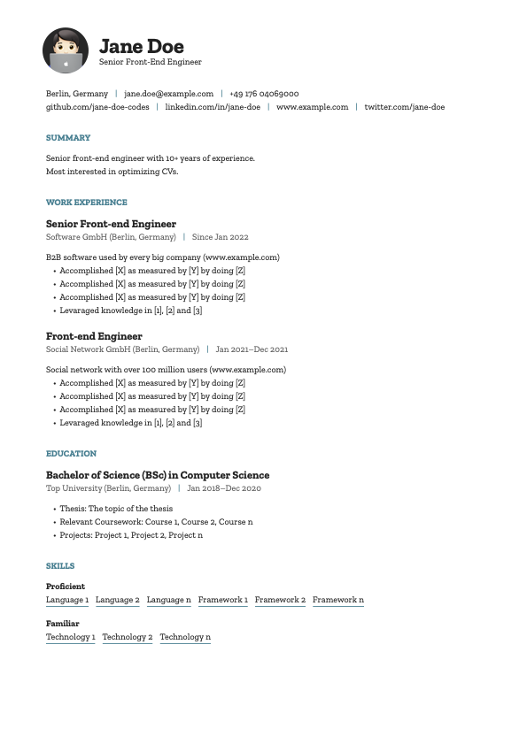

# @philippbaschke/cv

A React PDF and YAML CV generator

[](https://www.npmjs.com/package/@philippbaschke/cv)
[](https://github.com/xojs/xo)
[](LICENSE)

## Table of Contents

- [Usage](#usage)
- [CLI Commands](#cli-commands)
- [Example](#example)

## Usage

```sh
# Create the CV data project
npx @philippbaschke/cv init

# Go to the CV data project folder
cd cv-data

# Create the CV PDF
npx @philippbaschke/cv create

# Open the CV PDF with the default application
open cv.pdf
```

## CLI Commands

The commands can be run with `npx @philippbaschke/cv <command>`.

### init

The `init` command initializes a git project for the CV data.

#### Usage

```sh
npx @philippbaschke/cv init [path]
```

#### Arguments

| Name   | Default   | Description                                            |
| ------ | --------- | ------------------------------------------------------ |
| `path` | `cv-data` | A path where the CV data project should be initialized |

### create

The `create` command creates the PDF.

#### Usage

```sh
npx @philippbaschke/cv create [options] [output-file]
```

#### Arguments

| Name          | Default  | Description                          |
| ------------- | -------- | ------------------------------------ |
| `output-file` | `cv.pdf` | A path where the PDF should be saved |

#### Options

| Name                        | Default         | Description                 |
| --------------------------- | --------------- | --------------------------- |
| `-d, --data-project <path>` | `process.cwd()` | A path to a CV data project |

## Example

[](docs/cv.pdf)
